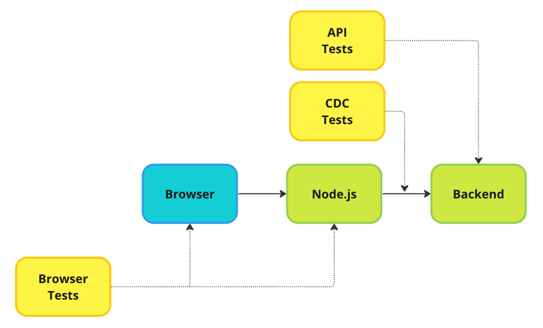
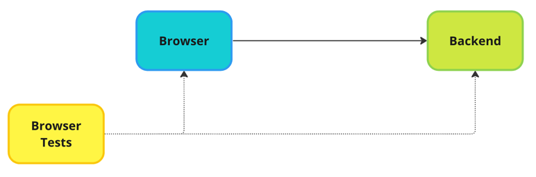
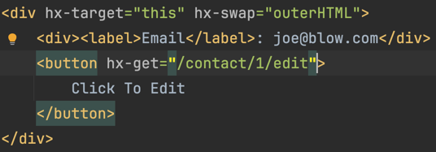
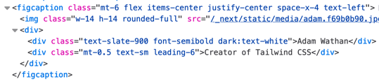
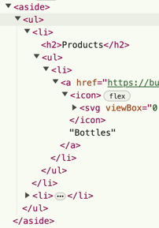

# Radically Simple HTML UIs

Most companies spend too much time and money making "industry standard", but hard to use, user interfaces. This article is going to talk about some principles that can be used to focus in on simple to develop, simple to maintain, user-focused UIs. It will concentrate on the "admin" side of things where utility and cost are the primary drivers.

This approach is **not** appropriate for drawing apps or word-processors. It *is* great for multi-page lists of data and simple webforms - something that Admin UIs are full of.

## A radically simple platform

It is common to develop a UI using a SPA framework that both renders HTML and maintains the state of the system. A node application is used to serve up or render the frontend javascript, provide the API needed to synchronise the frontend state with the backend state, and relay API calls to the actual backend.

A far simpler platform would be to serve HTML directly from the backend that is responsible for the domain that the User is interacting with. Remember we are talking about an Admin interface that is primarily used to interact with a system for operational activities.

This dramatically reduces the amount of code and infrastructure needed as we no longer need middle-man node apps to power complex frontend SPAs; we no longer need to keep the state of the system synchronised in multiple places (with inevitable inconsistencies); and we no longer need to create complex APIs, and their associated tests, to bind all these disparate pieces together.

Instead the system that is responsible for the state is also responsible for manipulating it, and the Web Browser is limited to a rich HTML5 UI with some minor JS enhancements.

## A radically simple interaction model

Many developers reach first for a frontend technology such as React or Vue even though an Admin website consists largely of lists and forms, both of which are directly - and well - support in HTML.

By doing so they may break various aspects of how browsers work (linkable pages, back-buttons, etc), write unnecessary javascript, and fundamentally ignore the way the web itself works.

Instead, by starting with plain-old HTML and enhancing it when we encounter an interaction that is not sophisticated enough, we reduce the amount of time, code and testing we need to put into our UI - and with HTML5 you will be pleasantly surprised how little you need to customise at all!

### HTMX for enhanced browsing

Additionally, [HTMX](https://htmx.org/) is a tiny javascript library that enhances your browser so that it more smoothly aligns with [HATEOAS](https://en.wikipedia.org/wiki/HATEOAS) principles, the underlying architecture of the web.

It uses attributes to enhance behaviour, replacing components in your webpage with new components rendered by on the server.

In this way you can achieve a lot of behaviour normally thought of as being exclusive to React websites, but with server-side rendering.

In [this example](https://htmx.org/examples/click-to-edit/), when the user clicks on the button, the static "Email" label is replaced with a form to update the email. The new form is retrieved from the server, the rest of the page remains untouched.

## A radically simple UI design

It is not unusual for modern html pages to be a stack-overflow of `div`s, all decorated with an embarrassment of `classes` that might as well be `styles`. Each component is tuned within a pixel of its life, making for complex, hard to maintain, and hard to build HTML.

This Utility-First approach, epitomized by [tailwind.css](https://tailwindcss.com/), is great for controlling beautiful UIs that delight our customers - but can take a lot of work to get right, encourage tweaking,  essentially map styles to classes, and fight with the "cascading" part of cascading style sheets.

A far simple design would be to essentially prohibit `classes`, only allowing CSS based upon tags and tag relations. 

This is exemplified by libraries such as [pico.css](https://picocss.com/), which has "fewer than 10" classes, and even a "class-less" version. Pico also encourages the use of aria tags and hence accessibility.

In this way, the vast majority of the time all components will render the same. This may not always look amazing, but it massively reduces the cognitive burden of working with styles, reduces discussions about look and layout, and hence increases development speed.

### Even more radical, for cheaters

We can even get rid of some classes by replacing them with "fake" tags! Unrecognised tags default to being `div`s, and therefore act essentially like a `div` with a single class - but you can't have more than one tag so you are forced to only have one "class". Additionally, the new tags can not override any of the other, more semantic tags, forcing non-semantic behaviour onto semantic components.

## A radically simple HTML renderer

Traditionally people have used templating languages to render text that is HTML. This is far inferior to using a GPL language with a functional library or DSL especially crafted for rendering HTML - as demonstrated by React and JSX.

Defining HTML in a strictly-typed GPL gains two massive advantages: type-safety and refactoring.

By accessing the Type system directly the HTML is now kept up-to-date with all changes in the service, and will break compilation if the Types change too radically.

Refactoring is also supported by your favourite IDE, allowing simple renaming and extracting of functions. This leads to easy creation of common components and other interesting abstractions not otherwise considered when using templates.

Of course your designers may push back against using a technology they are unfamiliar with (your GPL of choice) - but to optimise their time so they can get back to working on the customer facing work, have them work alongside your engineers. This will minimise the time the designers have to work on the Admin site, and increase the skills of your engineers so they may not need to ask for help as often.

## A radically simple threading model

There is a belief that, if you want to support thousands of interactions per second, you need to use asynchronous communications and threading models.

Since Admin UIs rarely have issues with volume of traffic, you can use much simpler synchronous communication and threading models.

Synchronous code is much easier to reason about, reducing cognitive load; it doesn't suffer from issues of eventual consistency; and synchronous communications provides fast feedback to users on the success of their actions.

# Conclusion

It is possible to constrain the needs of an Admin UI such that we can massively reduce the development effort to create it.

A simplified platform reduces infrastructure complexity, a simplified interaction model reduces frontend code, a simplified UI design reduces time spent creating markup, a simplified renderer reduces HTML code and rendering errors, and a simplified threading model reduces cognitive load and backend code.
